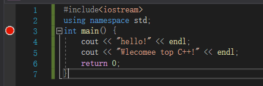

# 环境搭建

visual stutio 2019，直接官网下载community版，安装就ok

# hello world

```c++
#include<iostream>
using namespace std;
int main() {
	cout << "hello!" << endl;
	cout << "Wlecomee top C++!" << endl;
	return 0;
}
```

# 调试

F9快捷键加入断点



F10可以进行调试