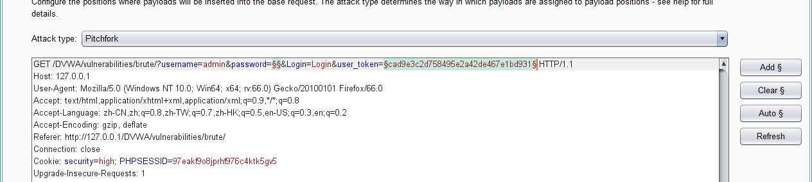

# DVWA

## brute force
### Low
```php+HTML
<?php
if( isset( $_GET[ 'Login' ] ) ) {
    // Get username
    $user = $_GET[ 'username' ];

    // Get password
    $pass = $_GET[ 'password' ];
    $pass = md5( $pass );

    // Check the database
    $query  = "SELECT * FROM `users` WHERE user = '$user' AND password = '$pass';";
    $result = mysql_query( $query ) or die( '<pre>' . mysql_error() . '</pre>' );

    if( $result && mysql_num_rows( $result ) == 1 ) {
        // Get users details
        $avatar = mysql_result( $result, 0, "avatar" );

        // Login successful
        echo "<p>Welcome to the password protected area {$user}</p>";
        echo "";
    }
    else {
        // Login failed
        echo "<pre><br />Username and/or password incorrect.</pre>";
    }
    mysql_close();
}
?> 
```
#### SQL注入
万能注入：username：admin'#
或者username：admin' or '1'='1
####  爆破
第一步抓包

第二步把包复制到intruder界面
在password处设置爆破点，attack type为sniper
第三步，payloads里面，
导入准备的6000字词典第四步，options里number of threads（线程）设置成20（比较快）
然后就start attack
找到长度不同的，就是密码

### Medium

```php+HTML
<?php
if( isset( $_GET[ 'Login' ] ) ) {
    // Sanitise username input
    $user = $_GET[ 'username' ];
    $user = mysql_real_escape_string( $user );

    // Sanitise password input
    $pass = $_GET[ 'password' ];
    $pass = mysql_real_escape_string( $pass );
    $pass = md5( $pass );

    // Check the database
    $query  = "SELECT * FROM `users` WHERE user = '$user' AND password = '$pass';";
    $result = mysql_query( $query ) or die( '<pre>' . mysql_error() . '</pre>' );

    if( $result && mysql_num_rows( $result ) == 1 ) {
        // Get users details
        $avatar = mysql_result( $result, 0, "avatar" );

        // Login successful
        echo "<p>Welcome to the password protected area {$user}</p>";
        echo "";
    }
    else {
        // Login failed
        sleep( 2 );
        echo "<pre><br />Username and/or password incorrect.</pre>";
    }
    mysql_close();
}
?> 
```

发现中级里面多了个函数，可以过滤，不能使用sql注入，所以使用爆破

第一步brupsuite抓包，发送到intruder
第二步在password处设置爆破点，attack type为sniper
第三步，导入词典然后就可以爆破了
第四步找到长度不同的就是密码

### High

```php+HTML

<?php 

if( isset( $_GET[ 'Login' ] ) ) { 
    // Check Anti-CSRF token 
    checkToken( $_REQUEST[ 'user_token' ], $_SESSION[ 'session_token' ], 'index.php' ); 

    // Sanitise username input 
    $user = $_GET[ 'username' ]; 
    $user = stripslashes( $user ); 
    $user = mysql_real_escape_string( $user ); 

    // Sanitise password input 
    $pass = $_GET[ 'password' ]; 
    $pass = stripslashes( $pass ); 
    $pass = mysql_real_escape_string( $pass ); 
    $pass = md5( $pass ); 

    // Check database 
    $query  = "SELECT * FROM `users` WHERE user = '$user' AND password = '$pass';";
    $result = mysql_query( $query ) or die( '<pre>' . mysql_error() . '</pre>' ); 

    if( $result && mysql_num_rows( $result ) == 1 ) { 
        // Get users details 
        $avatar = mysql_result( $result, 0, "avatar" ); 

        // Login successful 
        echo "<p>Welcome to the password protected area {$user}</p>"; 
        echo ""; 
    } 
    else { 
        // Login failed 
        sleep( rand( 0, 3 ) ); 
        echo "<pre><br />Username and/or password incorrect.</pre>"; 
    } 

    mysql_close(); 
} 

// Generate Anti-CSRF token 
generateSessionToken(); 

?> 
```

high也只能爆破
第一步抓包

但是发现多了一个user_token,在网页里查看源代码，

他的值每刷新一下都不一样，所以又多了一个爆破点
第二步放到intruder，添加两个爆破点，attack type要改成pitchfork

第三步，payloads里，payload list 选择1，同样导入字典

第四步，payload list 选择2，payload type改为recursive grep

第五步，进入options，number of threads改为1

在extract中，add，添加user_token这个这行的前后特征

然后最下面把never改为always
最后就可以开始攻击了，找到长度不同的，就是密码

### Impossible


## SQL Injection
1.判断是否存在注入，注入是字符型和还是数字型

2.猜解SQL查询语句中的字段数

3.确定显示的字段顺序

4.获取当前数据库

5.获取数据库中的表

6.获取表中的字段名

7.下载数据

### Low

```php+HTML

<?php 

if( isset( $_REQUEST[ 'Submit' ] ) ) { 
    // Get input 
    $id = $_REQUEST[ 'id' ]; 

    // Check database 
    $query  = "SELECT first_name, last_name FROM users WHERE user_id = '$id';"; 
    $result = mysql_query( $query ) or die( '<pre>' . mysql_error() . '</pre>' );

    // Get results 
    $num = mysql_numrows( $result ); 
    $i   = 0; 
    while( $i < $num ) { 
        // Get values 
        $first = mysql_result( $result, $i, "first_name" ); 
        $last  = mysql_result( $result, $i, "last_name" ); 

        // Feedback for end user 
        echo "<pre>ID: {$id}<br />First name: {$first}<br />Surname: {$last}</pre>"; 

        // Increase loop count 
        $i++; 
    } 

    mysql_close(); 
} 

?> 
```
```php+HTML
query="SELECT∗FROM users WHERE  username=".query="SELECT∗FROM users WHERE username="._GET[“name”]；
```

SELECT 列名 FROM 表名
用 * 取代列名就是选取所有列
WHRER 子句 通过有条件的从表中选取数据，可以将 WHRER 子句添加到SELECT 中
SELECT * from 表名 WHRER 列 运算符 值
1.输入'和\,证明数据库服务器为MySql
对于Mysql，构造SQL注入攻击查询语句时常会用到的注释符有`#` 和 `--` （双横杠后面加空格联用）。

Mysql安装后默认会创建三个数据库：information_schema、mysql和test。其中名为“mysql”的数据库很重要，它里面保存有MYSQL的系统信息、用户修改密码和新增用户，实际上就是针对该数据库中的有关数据表进行操作。
2.判断是否存在注入及判断注入类型


### Medium
### High
### Impossible


