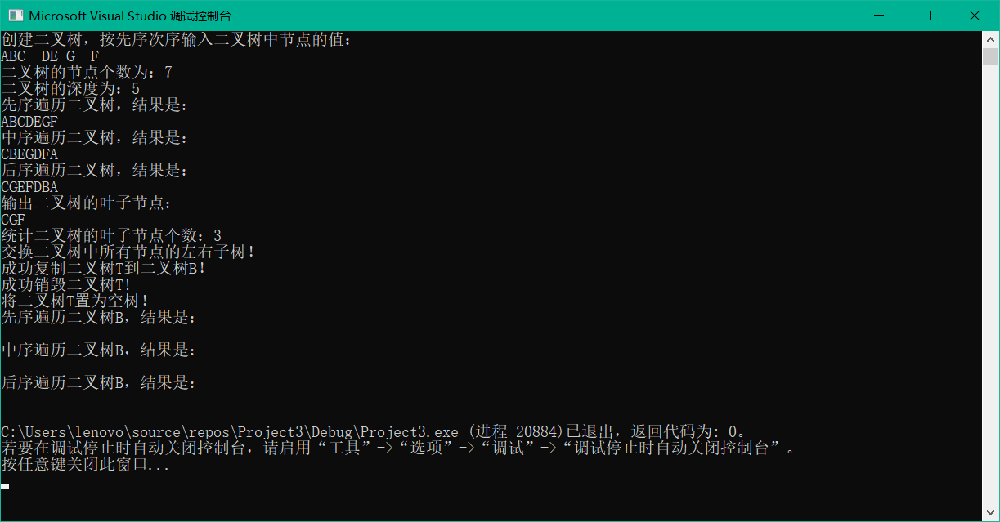

# 二叉树

## 递归

（1）构造二叉树  create
（2）复制二叉树 
（3）销毁二叉树 
（4）先序遍历二叉树 
（5）中序遍历二叉树 
（6）后序遍历二叉树 
（7）求二叉树的深度 
（8）求二叉树的结点数 
（9）求二叉树的叶子结点数 
（10）交换二叉树的左右子树
```c++
#include<stdio.h>
#include<stdlib.h> 
#include<stdarg.h>
#include<math.h> 
#define OK 1
#define ERROR 0
#define FALSE 0
#define TRUE 1
#define OVERFLOW -2
typedef struct BITNODE
{
	char data;
	struct BITNODE *left,*right;
}BITNODE,*BITREE;

int num=0;
int c=0;

//构造二叉树
int create(BITREE &T)
{
	char ch;
	scanf("%c",&ch);
	if(ch==' ')T=NULL;
	else
	{
		if(!(T=(BITNODE*)malloc(sizeof(BITNODE))))exit(OVERFLOW);
		T->data=ch;
		create(T->left);
		create(T->right);
	}
	return OK;
}//createtree


//先序遍历二叉树
int preorder(BITREE T)
{
	if(T)
	{
		printf("%c",T->data);
		if(preorder(T->left));
			if(preorder(T->right))return OK;
		return ERROR;
	}
	else return OK;
}//PreORderTraverse

int inorder(BITREE T)
{
	int m=0;
	if(T)
	{
		if(inorder(T->left))m=1;
		printf("%c",T->data);
		if(m)
			if(inorder(T->right))return OK;
		return ERROR;
	}
	else return OK;
}//InOrderTraverse

int postorder(BITREE T)
{
	if(T)
	{
		if(postorder(T->left))
			if(postorder(T->right))
			{
				printf("%c",T->data);
				return OK;
			}
		return ERROR;
	}
	else return OK;
}//PostOrderTraverse

int Depth(BITREE T)
{
	int leftDepth,rightDepth;
	if(T==NULL)return 0;
	else
	{
		leftDepth=Depth(T->left);
		rightDepth=Depth(T->right);
		if(leftDepth>=rightDepth)return leftDepth+1;
		else return rightDepth+1; 
	}
}

int NodeCount(BITREE T)
{
	if(T)
	{
		num++;
		if(NodeCount(T->left))
			if(NodeCount(T->right))return OK;
		return ERROR;
	}
	else return OK;
}//NodeCount


int LeftCount(BITREE T)
{
	if(T)
	{
		if(T->left==NULL&&T->right==NULL)
		{
			printf("%c",T->data);
			c=c+1;
		}
		if(LeftCount(T->left))
			if(LeftCount(T->right))return OK;
		return ERROR; 
	}
	else return OK;
}//LeafCount

//交换二叉树的左右子树
int Exchange(BITREE &T)
{
	BITREE p;
	if(T)
	{
		if(T->left||T->right)
		{
			p=T->left;
			T->left=T->right;
			T->right=p;
		}
		if(Exchange(T->left))
			if(Exchange(T->right))return OK;
		return ERROR;
	}
	else return OK;
}//ExchangeBiTree


//复制二叉树
int copy(BITREE T,BITREE &B)
{
	if(T==NULL)B=NULL;
	else
	{
		if(!(B=(BITNODE*)malloc(sizeof(BITNODE))))exit(OVERFLOW);
		B->data=T->data;
		copy(T->left,B->left);
		copy(T->right,B->right);
	}
	return OK;
}//CopyBiTree

int destroy(BITREE &T)
{
	if(T)
	{
		destroy(T->left);
		destroy(T->right);
		free(T);
	}
	return OK;
}//DestroyTree

int clear(BITREE &T)
{
	if(T)
	{
		T=NULL;
	}
	return OK;
}//ClearTree

int main()
{
	BITREE T,B;
	printf("创建二叉树，按先序次序输入二叉树中节点的值：\n");
	create(T);
	NodeCount(T);
	printf("二叉树的节点个数为：%d\n",num);
	printf("二叉树的深度为：%d\n",Depth(T));
	printf("先序遍历二叉树，结果是：\n");
	preorder(T);
	printf("\n");
	printf("中序遍历二叉树，结果是：\n");
	inorder(T);
	printf("\n");
	printf("后序遍历二叉树，结果是：\n");
	postorder(T);
	printf("\n");
	printf("输出二叉树的叶子节点：\n");
	LeftCount(T);
	printf("\n");
	printf("统计二叉树的叶子节点个数：%d\n",c);
	printf("交换二叉树中所有节点的左右子树！\n");
	Exchange(T);
	if(copy(T,B)==OK)printf("成功复制二叉树T到二叉树B！\n");
	if(destroy(T)==OK)printf("成功销毁二叉树T!\n");
	if(clear(T)==OK)printf("将二叉树T置为空树！\n");
	printf("先序遍历二叉树B，结果是：\n");
	preorder(T);
	printf("\n");
	printf("中序遍历二叉树B，结果是：\n");
	inorder(T);
	printf("\n");
	printf("后序遍历二叉树B，结果是：\n");
	postorder(T);
	printf("\n");
}
```
输入ABC##DE#G##F###
#表示空格字符。
### 运行情况


# 数组

（1）构造数组 （2）销毁数组 （3）取数组元素值 （4）给数组元素赋值

```c++
#include<bits/stdc++.h>
using namespace std;
#include<stdarg.h>
#include<math.h> 
#define OK 1
#define ERROR 0
#define FALSE 0
#define TRUE 1
#define OVERFLOW -2
#define max 8
typedef struct
{
	int *base;
	int *bounds; //数组维界基址 
	int dim;// 维数 
	int *constants;
 }array;
 int init(array &a,int dim,...)
 {
    int i;
	va_list ap;
	int elemtotal=1;
	if(dim<1||dim>max)return ERROR;
	a.dim=dim;
	a.bounds=(int*)malloc(dim*sizeof(int));
	if(!a.bounds)exit(OVERFLOW);
	va_start(ap,dim);
	for(i=0;i<dim;i++)
	{
		a.bounds[i]=va_arg(ap,int);
		if(a.bounds[i]<0)return UNDERFLOW;
		elemtotal*=a.bounds[i];
	}
	va_end(ap);
	a.base=(int*)malloc(elemtotal*sizeof(int));
	if(!a.base)exit(OVERFLOW);
	a.constants=(int*)malloc(dim*sizeof(int));
	if(!a.constants)exit(OVERFLOW);
	a.constants[dim-1]=1;
	for(i=dim-2;i>=0;i--)
	{
		a.constants[i]=a.bounds[i+1]*a.constants[i+1];
	}
	return OK;
 }// init
 
 int destroy(array &a)
 {
	if(a.base)free(a.base);
	if(a.bounds)free(a.bounds);
	if(a.constants)free(a.constants);
	a.base=a.bounds=a.constants=NULL;
	return OK;
 }//destroy
 
 int locate(array a,va_list ap,int &off)
 {
	int j,i;
	off=0;
	for(i=0;i<a.dim;i++)
	{
		j=va_arg(ap,int);
		if(j<0||j>=a.bounds[i])return ERROR;
		off+=a.bounds[i]*j;
	}
	return OK;
 }
 
 int value(array a,int &e,int i,...)
 {
	va_list ap;
	int result,off;
	va_start(ap,i);
	if((result=locate(a,ap,off))<=0)return result;
	e=*(a.base+off);
	return OK;
 } 
 int assign(array &a,int e,...)
 {
	va_list ap;
	int result,off;
	va_start(ap,e);
	if((result=locate(a,ap,e))<=0)return result;
	*(a.base+off)=e;
	return OK;
 }
 int main()
 {
	array a;
	int e=0;
	init(a,3,2,3,4);
	assign(a,100,1,2,3);
	if(value(a,e,0,1,2,3)==OK)printf("输出e的值：%d\n",e);
	if(destroy(a)==OK)printf("数组a销毁成功！\n"); 
 }
```

定义的稀疏矩阵的三元组顺序表存储表示，编程实现矩阵的转置运算算法和快速转置算

```c++
#include<stdio.h>
#include<stdlib.h>
#include<stdarg.h>
#include<math.h> 
#include<time.h>
#define OK 1
#define ERROR 0
#define FALSE 0
#define TRUE 1
#define OVERFLOW -2
#define max 12500
#define MU 5
#define NU 6 
typedef struct
{
	int i,j;
	int e;
}T;
typedef struct
{
	T data[max+1];
	int mu,nu,tu;
}TS;

int create(TS &M)
{
	int e,i,j,k=1;
	M.mu=MU;
	M.nu=NU;
	srand((unsigned)time(NULL));
	M.tu=rand()%15;
	for(i=1;i<=M.mu;i++)
	{
		for(j=1;j<=M.nu;j++)
		{
			e=rand()%30;printf("%");
			if(e!=0)
			{
				M.data[k].i=i;
				M.data[k].j=j;
				M.data[k].e=e;
				k++;
				if(k==M.tu)break;
			}
		}
	}
	return OK;
}

int transpose(TS m,TS &t)
{
	int q=1;
	int col,p;
	t.mu=m.nu;
	t.nu=m.mu;
	t.tu=m.tu;
	if(t.tu)
	{
        for(col=1;col<=m.nu;++col)
		{
            for(p=1;p<=m.tu;p++)
		    {
                if(m.data[p].j==col)
	            {
				    t.data[q].i=m.data[p].j;
				    t.data[q].j=m.data[p].i;
				    t.data[q].e=m.data[p].e;
				    ++q;
		       	}
		    }
	    }
	}
	return OK;
}

int print(TS M)
{
	int k;
	printf("mu=%-2d, nu=%-2d, tu=%-2d",M.mu,M.nu,M.tu);
	printf("\n");
	for(k=1;k<=M.tu;k++)
	{
		printf("i=%-2d. j=%-2d, e=%-2d",M.data[k].i,M.data[k].j,M.data[k].e);
		printf("\n");
	}
}

int main()
{
	TS m,t;
	create(m);	transpose(m,t);
	printf("输出稀疏矩阵m：\n");
	print(m);
	printf("输出转置矩阵t：\n");
	print(t); 
}
```

