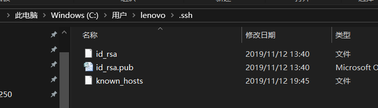
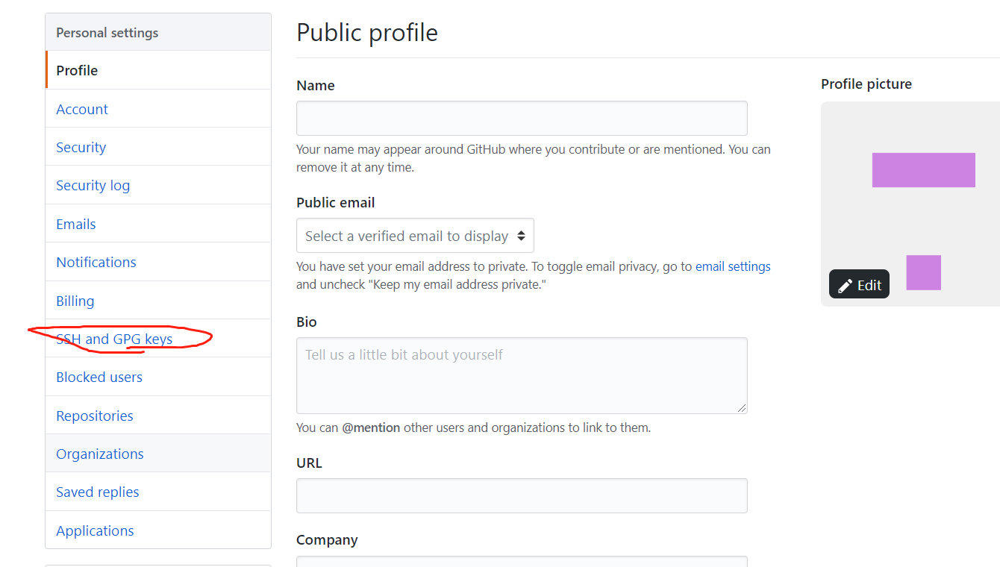
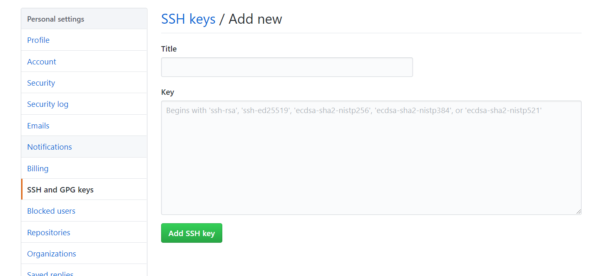
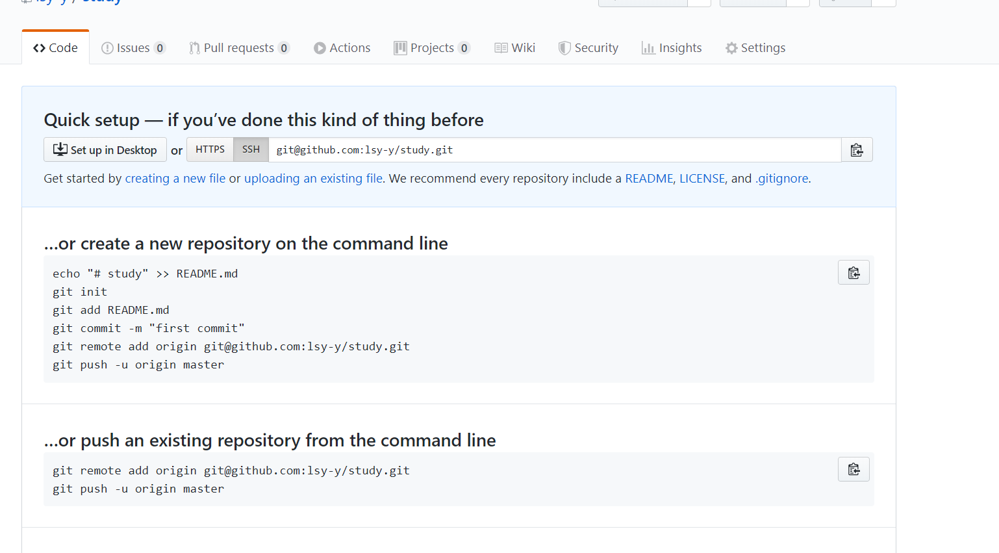

<https://www.liaoxuefeng.com/wiki/896043488029600/896067074338496>

我就是在这个网站学习的git和github，讲的很清楚，很适合什么都不懂的小白

# Git简介

创建版本库(仓库),(repository)选择一个合适的地方,

```
$ mkdir learngit
$ cd learngit
$ pwd
/Users/michael/learngit
```

`pwd`用于显示当前目录

第二步,通过`git init` 命令可以把这个目录变成Git可以管理的仓库

```
$ git init
```
然后git就把仓库建好了,在这个文件里可以发现一个`.git`的文件,不要随意修改,不然就会乱
那么如何把一个文件添加到仓库里呢
第一步,把需要的文件放在learngit这个文件夹里,然后用`git add file`把文件放到仓库
```
$ git add 文件
```
然后会没有任何提示,"没有消息就等于好消息
第二步,用命令`git commit`告诉Git,把文件提交到仓库
```
$ git commit -m "写了一个文件"
```
`-m`后面输入的是本次提交的说明,可以是任意的内容.

`git commit`成功后,`1 file change`:一个文件被改动

`git add`一次只能提交一个文件,`git commit`一次可以提交很多文件,所以可以`add`很多,再`commit`


# 远程仓库

第1步：创建SSH Key。
在用户主目录下，看看有没有.ssh目录，



如果有，再看看这个目录下有没有id_rsa和id_rsa.pub这两个文件，如果已经有了，可直接跳到下一步。如果没有，打开Shell（Windows下打开Git Bash），创建SSH Key：

```
$ ssh-keygen -t rsa -C "youremail@example.com"
```
你需要把邮件地址换成你自己的邮件地址，然后一路回车，使用默认值即可，由于这个Key也不是用于军事目的，所以也无需设置密码。
如果一切顺利的话，可以在用户主目录里找到.ssh目录，里面有id_rsa和id_rsa.pub两个文件，这两个就是SSH Key的秘钥对，id_rsa是私钥，不能泄露出去，id_rsa.pub是公钥，可以放心地告诉任何人。
第2步：登陆GitHub，打开“Account settings”，“SSH Keys”页面：

然后，点“Add SSH Key”，填上任意Title，在Key文本框里粘贴id_rsa.pub文件的内容：

在github上新建一个new repository




## 连接远程仓库
```
$ git remote add gitlab git@xxx.com
例  $ git remote add origin git@github.com:lsy-y/study.git
```
gitlab是远程仓库在本地的名称！
git@xxx.com可以直接从github上复制


如何取消远程仓库连接

```
$ git remote -v           查看现在的连接
```

```
$ git remote rm gitlab     取消链接//gitlab是远程仓库在本地的名称
```
连接成功后,可以直接推上去了
```
$ git push -u origin master
```
