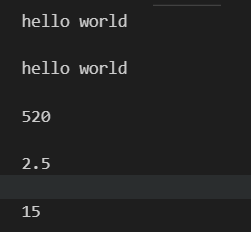
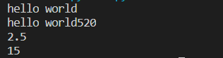

# python

## print

```python
print("hello world")
print('hello world')
print(520)
print(5/2)
print(5*3)
```



print自带换行，print(,end"")消除换行，

```python
print("hello world")
print('hello world',end="")
print(520)
print(5/2)
print(5*3)
```



## 注释

```python
print("hello world")
print('hello world',end=" ")
#print(520)
'''
print(5/2)
print(5*3)
'''
print("xixi")
```

单行注释：#

多行：‘’‘。。。。。。’‘’

